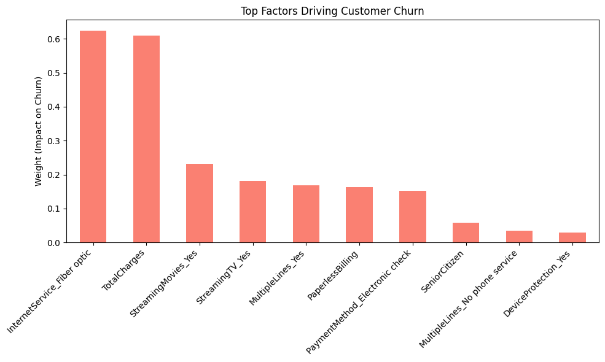

# Customer Retention & Churn Risk Analysis

### 📊 Project Overview
Built a machine learning pipeline to predict customer attrition for a telecommunications firm. Analyzed over **7,000 customer records** to identify key churn drivers and recommended targeted retention strategies for high-risk segments.

### 🛠️ Tech Stack
* **Python:** Pandas, NumPy, Scikit-Learn.
* **Models:** Logistic Regression, K-Nearest Neighbors (KNN).
* **Visualization:** Matplotlib, Seaborn.

### 🔍 Key Findings
1.  **High-Risk Segment:** Customers with **Fiber Optic** internet service are significantly more likely to churn compared to DSL users.
2.  **Payment Method:** "Electronic Check" users show higher attrition rates, suggesting a need to incentivize automated bank transfers.
3.  **Model Performance:** Achieved **~80% Accuracy** with Logistic Regression, successfully identifying the majority of at-risk customers.

### 📈 Visuals

*(Top factors influencing churn: Fiber Optic service and Monthly Charges are the biggest predictors.)*
